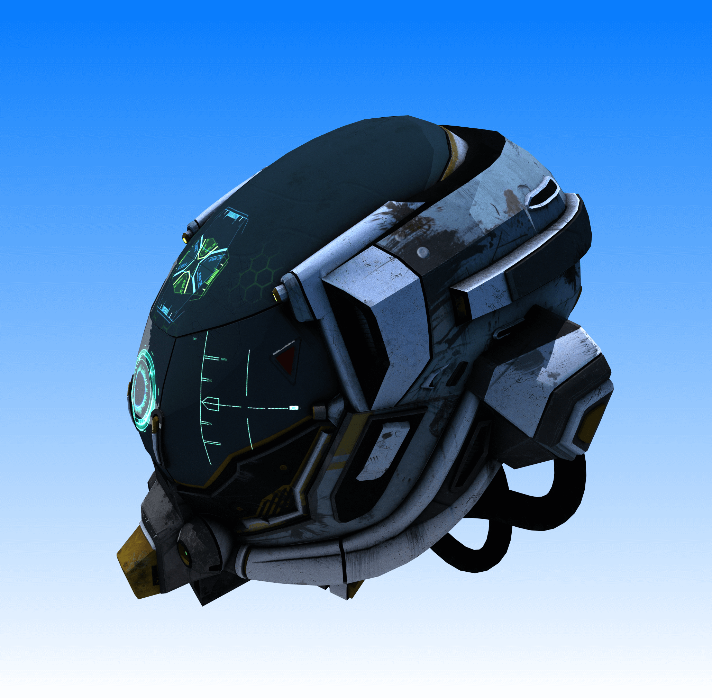
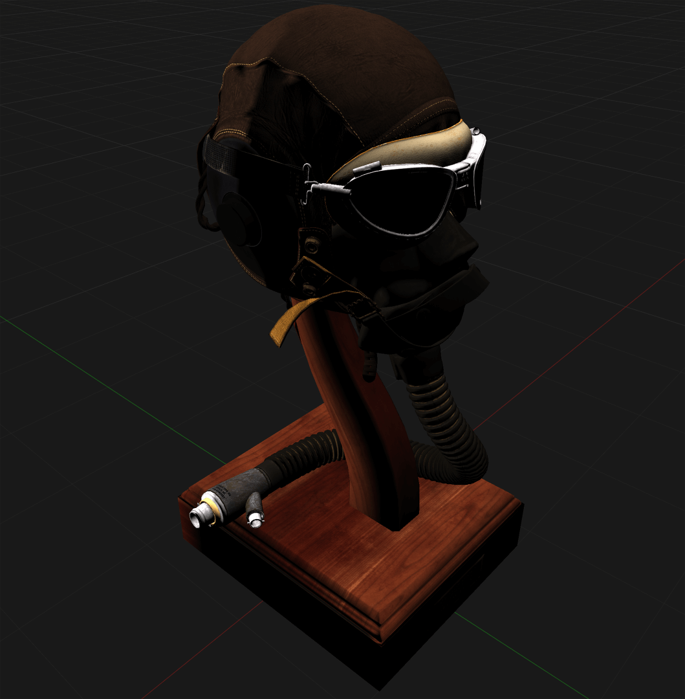
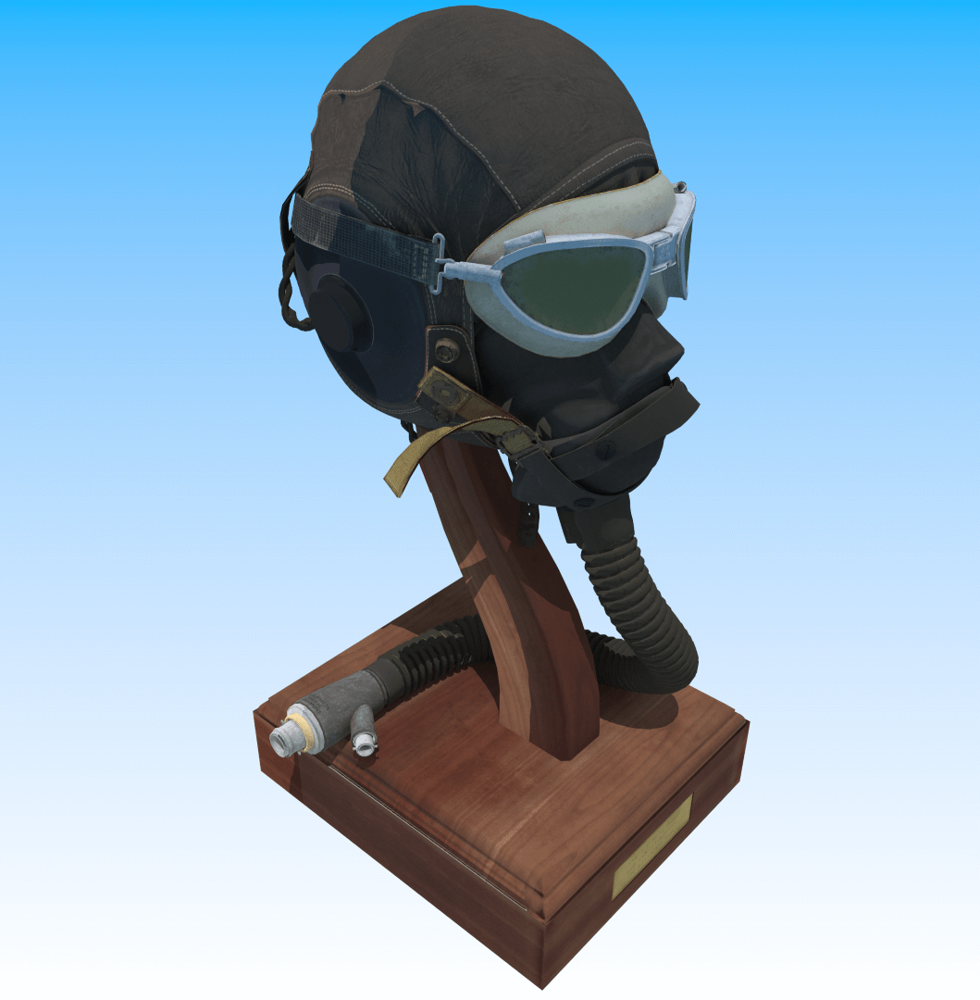

# Kirana

A hardware accelerated pathtraced PBR render engine using Vulkan Raytracing API.

| Cornell Box                              | Pixar's Renderman Swatch                                  | Damaged Helmet                                  |
|------------------------------------------|-----------------------------------------------------------|-------------------------------------------------|
|  |  |  |

| Raster                              | Raytrace                                         |
|-------------------------------------|--------------------------------------------------|
|  |  |

## Features

- [x] Realtime interactive viewport
- [x] Raster Engine
    - [ ] Shadow Mapping
    - [ ] Reflections
    - [ ] Indirect Lighting
    - [ ] Image Based Lighting
- [x] Raytrace Engine
    - [x] Monte-Carlo Pathtracing
    - [x] Importance Sampling
    - [ ] Optimizations (Russian-Roullete,...)
    - [ ] Multi-Importance Sampling
    - [ ] Image Based Lighting
- [x] Disney PBR Shading
    - [x] BRDF
    - [ ] BTDF
    - [ ] BSSRDF
-  [x] Textures
- [x] Custom Math Library
    - [ ] SIMD support
- [x] Vulkan Bindless Architecture
    - [x] Bindless Material Data
    - [x] Bindless Textures
- [ ] GPU Driven Rendering
    - [ ] Indirect Draw commands
    - [ ] Task-Mesh Shader support
    - [ ] Meshlet frustum / occlusion-based culling
- [ ] UI
    - [x] Python Pyside2 Base UI
    - [ ] Viewport UI (Scene, Hierarchy, Property Panel, File Browser)

## Installation

### Prerequisites

- <b>MSVC Compiler</b> V.16.0 or greater
- <b>CMake</b> V.3.0 or greater
- <b>Python</b> V.3.9 (For building UI)
- <b>Vulkan SDK</b> V.1.3.239 or greater
- Vulkan `VK_KHR_ray_tracing_pipeline` extension supported devices (Nvidia RTX, AMD RX)

### Project Installation

- The repository uses submodules, so clone the repository using:

```
git clone --recurse-submodules https://github.com/SurajShettigar/Kirana.git
```

- Extract `data.zip` file into the current directory of the project. It contains the default resources needed for the
  app.
  ```
  root
  |    README.md
  |    data.zip
  |____data
  |    |    Cornell_Box.fbx
  |    |____Prman_Swatch
  |             Prman_Swatch.fbx
  |____kirana
  |____sgader
  ```
- Build using cmake

## Usage

- Orbit Camera: `ALT` + `Left Mouse Button`
- Pan Camera: `ALT` + `Middle Mouse Button`
- Zoom Camera: `ALT` + `Right Mouse Button`
- Switch to Raytracing Pipeline: `R`
- Switch to Raster Pipeline: `T`
- Basic Shading: `O`
- PBR Shading: `P`

> Note: You can place any FBX, GLTF, OBJ model in the `data` folder and load it. You need to change
> the `DEFAULT_MODEL_NAME` variable located in the `constants.h` file: `<root>/kirana/utils/constants.h`. Change the
> variable with the relative-path of the model file. (Relative to `data` directory)
>> Temporary solution until UI is completed.

## Performance

#### Platform

- Windows 11
- Intel Core i7-10750H @ 2.6 GHz (Laptop)
- **Nvidia RTX 2060** 6GB VRAM (Laptop)
- 16GB RAM @ 3200 MHz

#### Scene

- Blender 2.81 Splashscreen <b>(Credits: [The Junk Shop](https://cloud.blender.org/p/gallery/5dd6d7044441651fa3decb56)
  by Alex Treviño. Original Concept by Anaïs Maamar.)</b>
- Details:
    - Vertices: **9,115,716**
    - Triangles: **4,262,508**
    - Materials: **25**

#### Performance

- Display @ **3840x2160p**
- Raster Pipeline: Approx. **3.6 ms (280 FPS)**
- Raytrace Pipeline: Approx. **66.6 ms (15 FPS)**


## References

- [VKGuide](https://vkguide.dev/)
- [Nvidia Vulkan Raytracing Tutorial](https://nvpro-samples.github.io/vk_raytracing_tutorial_KHR/)
- [PBRT 3rd Edition](https://pbr-book.org/)
- [Fundamental of Computer Graphics](https://www.petershirley.com/)
- [3D Math Primer](https://gamemath.com/)
- [Disney's PBR Shading](https://media.disneyanimation.com/uploads/production/publication_asset/48/asset/s2012_pbs_disney_brdf_notes_v3.pdf)


